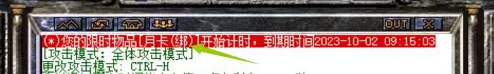

# 登录游戏时的聊天框最上方显示公告

**登录游戏时的聊天框最上方显示公告**

**功能：**登录游戏时的聊天框最上方显示公告
**和普通公告一样属于聊天框滚动公告，只是显示位置靠前
------------------------------------------------

**\*登录游戏时的聊天框最上方显示公告**

格式：脚本放入QManage.txt
读取QM中[@BeforeLogin]字段

[@BeforeLogin]
#ACT
SENDMSG 1 在登录后“攻击模式”提示前面显示文字<$USERNAME>

图示：

**
