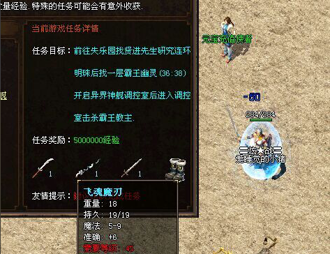

# NPC对话框调用装备信息（支持物品图片以及展示属性）

**脚本调用：**

<ItemShow:D:F:X:Y:Z:W:G/@Label>

参数说明：
d= 数据物品ID
F= 数量(数量设置小于1则不显示)
X Y = 微调坐标 排版的
Z= 是否显示物品框，0为不显示，1为显示(当为1时，读取NewopUI.pak:250)，值>1 (NewopUI.pak中指定素材)
W= 首饰发光代码，代码与light一样（不需要则可忽略不填写这个参数 ，或填写0）
G= 灰化显示(0或空=正常，1=灰化)
U= 数量是否显示单位（0为不显示单位；1:超过10000时显示单位W)
鼠标放上去显示物品属性。类似图标的用法
@Label是点击图片时需要触发的脚本标签. (不需要跳转则可不需填写，如：<ItemShow:D:F:X:Y:Z:W:G:U>)

效果展示：

.
