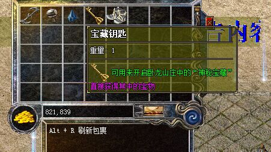

# 悬浮式装备信息窗口支持图片显示

**物品备注悬浮式装备信息窗口支持图片显示**(可使用到物品备注、套装备注)：

**物品备注示例：**
宝藏钥匙=250/<looks:1184>可用来开启卧龙山庄中的“神秘宝藏”\253/直接获得其中的宝物
火龙神甲=250/<StateItem:595>可用来开启卧龙山庄中的“神秘宝藏”\253/直接获得其中的宝物
文字均支持单行文字颜色自定义 插入：{文字内容|文字颜色0-255} 如：宝藏钥匙=250/<looks:1184<可用来开启{卧龙山庄|251}中的“神秘宝藏”\253/直接获得其中的宝物

.

**支持以下方式展示：**

1、Looks支持：读取Items或Items1.....
格式：<looks:N:X:Y:Z>
说明：N=图片位置；X=X偏移；Y=Y偏移 Z=是否显示物品背景框(0,1)
<looks:1184:0:0:1>

2、NewopUI支持；读取NewopUI.pak
格式：<NewopUI:N:X:Y>
说明：N=图片位置；X=X偏移；Y=Y偏移
<NewopUI:1184:0:0>

3、Img支持
格式：
N表示显示文件中的第几个图片,F表示WIL文件序号,X是横向坐标,Y是纵向坐标.
F=WIL文件序号(详见引擎：查看-列表信息(二)-WIL资源)
X和Y这两个坐标可以使图片显示的坐标更加精准.

4、PlayImg支持
格式: <PlayImg:F:N:C:T:X:Y:M>
F表示WIL文件序号,N表示播放开始图片,C表示播放张数,T表示播放速度(毫秒),X是横向坐标,Y是纵向坐标.
F=WIL文件序号(详见引擎：查看-列表信息(二)-WIL资源)
X和Y这两个坐标可以使图片显示的坐标更加精准.
M：绘制模式（0:原始绘制; 1:透明绘制; 2:底层原始绘制;3:底层透明绘制)

5、悬浮框物品备注属性栏将数字转换为图片

装备栏提示 ( 没有 提示信息/@脚本触发)
<ImgNum: 数字类型(0-9): 数字值: 字符间隔: X: Y>
图片位置：NewopUI.pak 1230开始---1329结束 （10组数字）
