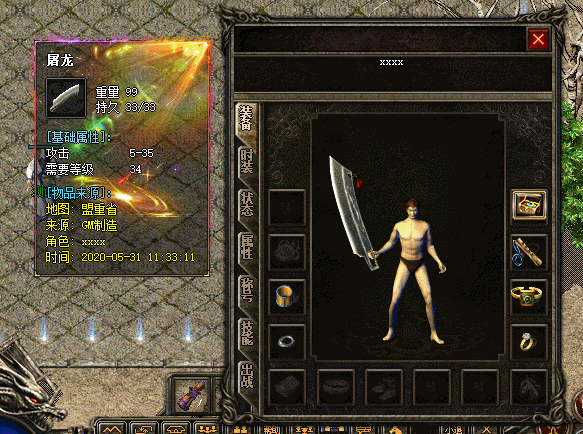
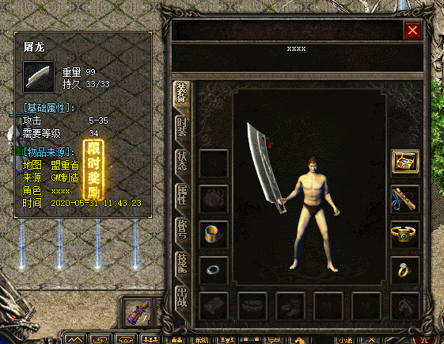
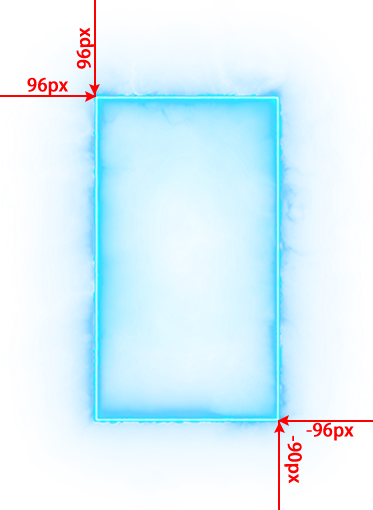

# 设置物品悬浮框背景特效

功能说明:
设置物品悬浮框背景特效

说明：设置物品悬浮框背景特效

--------------------------------------------------------

特效设置位置：列表信息2――》悬浮框背景特效

--------------------------------------------------------

操作命令：
SetItemWindowEffectIndex 物品位置 特效位置(0-2) 特效编号(0为关闭)

物品位置:
-1 升级框
boxitem0-boxitem7 自定义OK框
0 盔甲.....
30-35 首饰盒
40-51 生肖盒

例子：
[@test]
#act
SetItemWindowEffectIndex 1 0 1
SetItemWindowEffectIndex 1 1 3
SetItemWindowEffectIndex 1 2 10

;PS:单物品最多设置3个特效

;固定坐标M2设置左、上参数
;平铺模式M2设置左、上、右、下参数

;固定模式时，图片会按照设置的坐标固定显示

;平铺模式时，图片会自动缩放绘制在整个装备悬浮框上，如果图片周围有空图片，需要设置空白的宽度对齐

--------------------------------------------------------

--------------------------------------------------------

悬浮框素材配置图解

