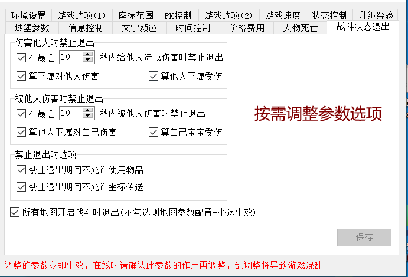

# 战斗状态禁止退出

**功能：战斗状态禁止退出：**

**位置：选项 - 参数设置 - 战斗禁止退出**

图示：

.

根据需求自行调整参数选项进行设置

;===================================================

**检测人物是否处于战斗状态**

命令： CheckBattleStatus

**示范脚本**

[@战斗状态]
#IF
CheckBattleStatus
#act
SENDMSG 6 处于战斗状态
#ELSEACT
SENDMSG 6 非战斗状态
