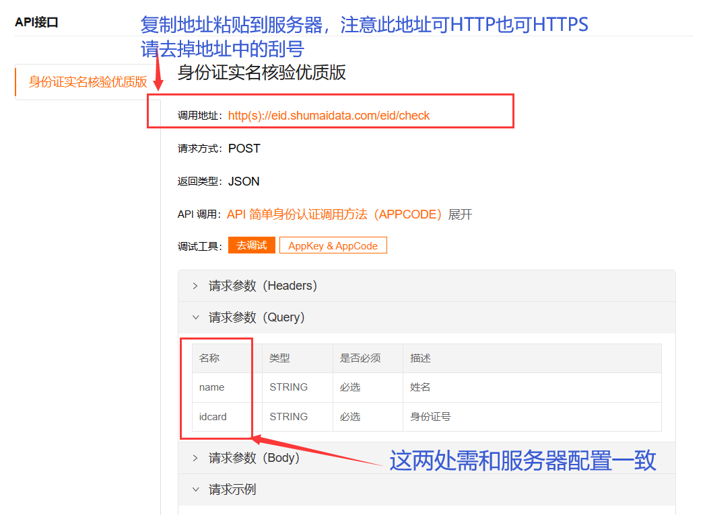
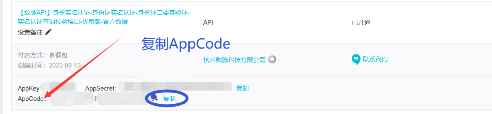
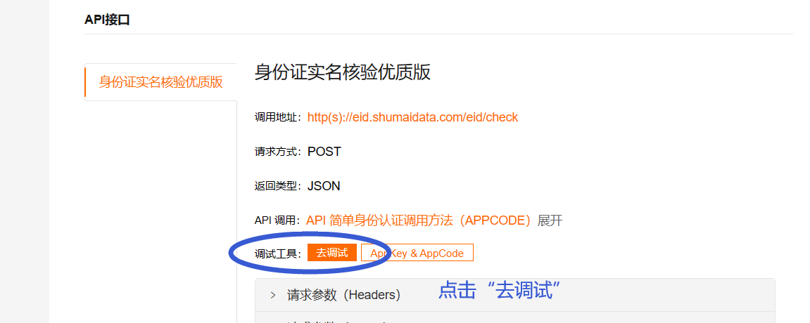
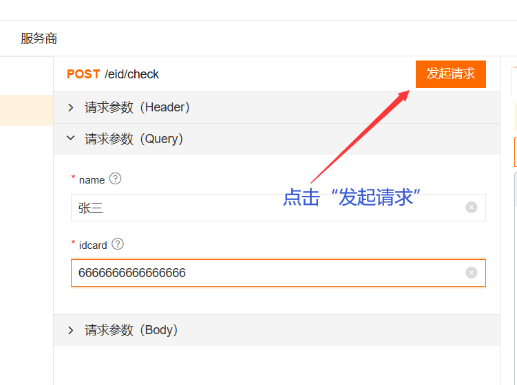
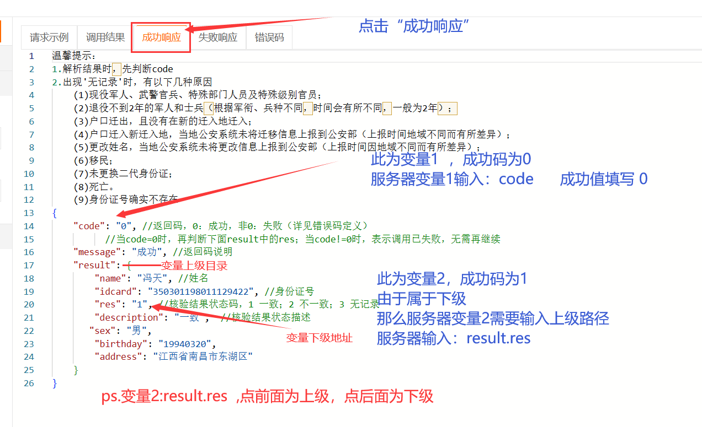
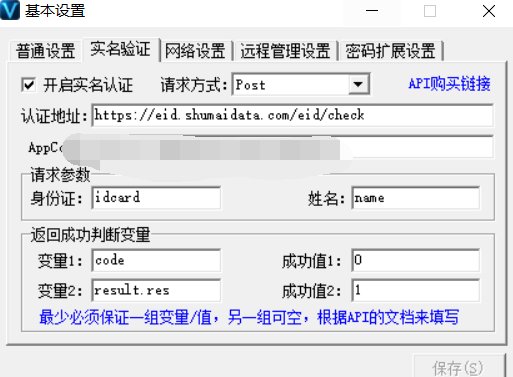
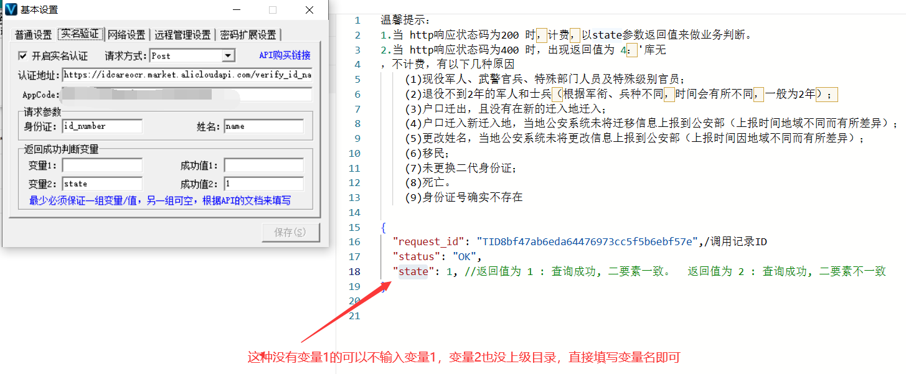
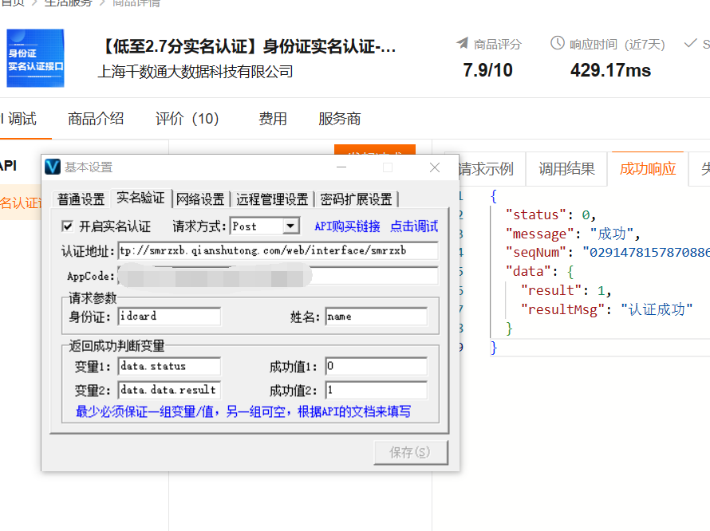
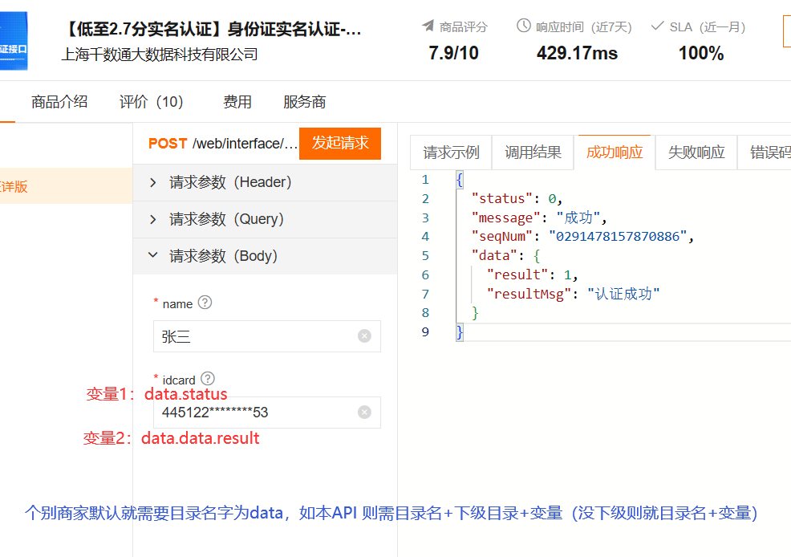

# 实名认证（身份认证二元素）

**实名认证（身份认证二要素）**

**功能：**身份证实名认证

**\*本实名认证系统适用于阿里云市场身份二要素认证（正式使用前，请先在云市场购买测试确定该商家的身份认证二要素是否可正常使用）...**

1.图文说明

将调用地址复制填写到服务器上，对比名称是否和服务器匹配，如不一致将名称对应填写到服务器上

--------------------------------------------------------

复制该商家的Appcode 填写到复制器上

--------------------------------------------------------

进入到调试页面获取变量信息

--------------------------------------------------------

点击调试页面的“发起请求”

--------------------------------------------------------

请求完成后点击“成功响应”获取变量信息，并将变量和对应成功码填写到服务器

--------------------------------------------------------

填写后的效果图（完成配置）：

--------------------------------------------------------

**\*部分商家变量只有1个，如下图...**

--------------------------------------------------------

**\*部分商家自身就存在目录名字那么填写变量需要填写目录名称+变量名（成功响应中变量如果还存在上级目录则为：目录名+下级目录+变量）如下图...**

**\*因云市场提供身份认证二要素的商家过多，而且部分商家调用变量填写方式不同 ，所以正式使用前请先测试该商家的认证API是否可正常使用再进行购买套餐包...**

**\*以上是三种常见API调用实例，不同商家API变量填写请自己测试，理论上以上三种变量填写方式的总有一种适用（最直接方式就是参阅商家提供的api文档填写）...**
